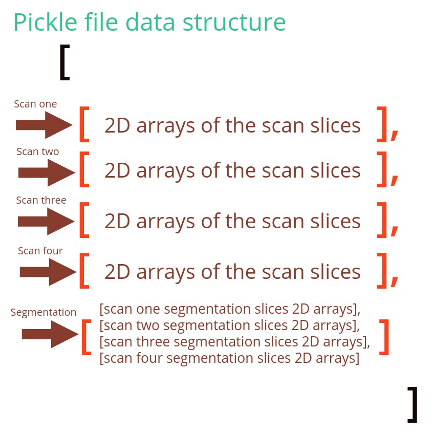

# TCGA-GBM Dataset Patient Pickle File Generation

This repository was created to log and report all the steps and stages taken in the pre-training
phase of the brain tumor deep learning detection module. In a nutshell, the python notebooks in 
this repository iterates over all the patient dicom files and their correspondant segmentation
files and stores saves the image arrays in a separate file for every patient. This was done in a number 
of stages. These were:

- **Stage #1:** Storing the patient scans and their respective segmentation scans in a pickle file for every patient.
- **Stage #2:** Sampling all the pickle file data to have a shape of (256,256) as a perpping generalization phase prior
to using these images in the network.

## Stage One: Dataset iteration and storage of patient data in pickle files
In this stage it first is important to understand how the final data file is supposed to look like in order to be able to understand the procedure taken to build it.
The pickle file is named with the patient ID. For example: *TCGA-xx-xxxx.pickle*.
The pickle file components is an array composed of 5 arrays. The first 4 arrays are the original scans
of the patient corresponding to the available scan segmentations. These scan types are mainly **T1, T2, FLAIR and POST**. Each of the 4 arrays of the scan types contain inside it the slices. The 5th array is composed of 4 arrays inside it each of which coressponds to one of the original scan arrays. To put it into picture, consider the following illustration:

